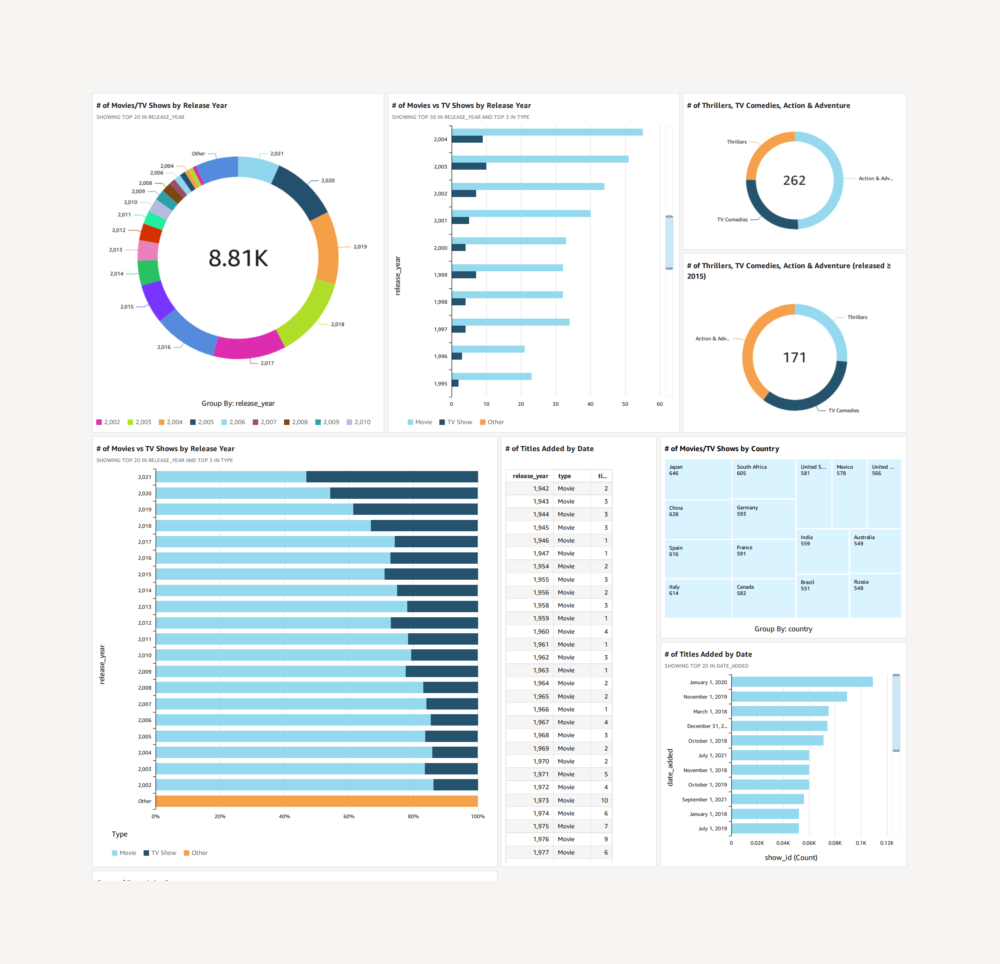

# 🎬 Netflix Dashboard com AWS QuickSight

Projeto de visualização de dados construído com AWS S3 e QuickSight, com ênfase em boas práticas de BI e storytelling com dados.

## Objetivo

O objetivo do projeto foi explorar um dataset público da Netflix com foco em aplicar boas práticas de visualização e dominar ferramentas AWS. Os dados foram carregados no **Amazon S3**, conectados ao **AWS QuickSight**, e organizados em visualizações que respondem perguntas como tendências de lançamento, país de origem, gêneros e distribuição temporal.

---

## O que foi feito

- 🪣 Upload do dataset `netflix_titles.csv` para um bucket no Amazon S3.
- 🔗 Conexão do dataset ao Amazon QuickSight diretamente via S3.
- 💡 Criação de análises com gráficos de barra, tabela e gráfico de rosca.
- 🗂️ Visualização do catálogo de filmes e séries por:
  - Ano de lançamento
  - Tipo (Filme/Série)
  - Data de adição ao catálogo

---

## Preview do Dashboard

---

## Etapas do projeto:

1. Armazenamento dos Dados: Dados públicos sobre títulos da Netflix foram baixados do Kaggle em formato .csv e armazenados diretamente no Amazon S3, sem necessidade de tratamento ou preparação prévia.

2. Conexão com o QuickSight: O Amazon QuickSight foi configurado para acessar os dados diretamente do Amazon S3 por meio de um manifest file, permitindo a criação de uma fonte de dados personalizada.

3. Modelagem e análise: Realizei a modelagem básica dentro do QuickSight, com criação de filtros e agrupamentos, preparando os dados para análises exploratórias.

4. Criação do dashboard - Desenvolvi visualizações interativas com o objetivo de responder perguntas como:

  - Quais os gêneros mais populares?
  - Quantos títulos foram adicionados por ano?
  - Qual o país com mais produções?
  - Distribuição de classificações indicativas (rating)

## Armazenamento e Conexão do Dataset no Amazon S3 com QuickSight

Para facilitar o acesso e a visualização dos dados no QuickSight, armazenei o dataset netflix_titles.csv em um bucket do Amazon S3 chamado quicksight-project-saahmukai. Também criei e editei um arquivo manifest.json, que é essencial para o QuickSight entender o formato e a localização do dataset.

### O processo foi:

1. Criação do bucket S3 para armazenar os arquivos do dataset.

2. Upload do arquivo CSV (netflix_titles.csv) para o bucket.

3. Modificação do arquivo manifest.json para incluir o caminho correto do CSV no S3.

4. Re-upload do arquivo manifest.json modificado no bucket.

### Na configuração do QuickSight:

1. Criei uma nova fonte de dados do tipo S3, utilizando o bucket criado.

2. Conectei o QuickSight ao arquivo manifest.json para que ele pudesse interpretar corretamente os dados.

3. Importeio o dataset com sucesso, confirmando a conexão.

### Na etapa de análise e visualização:

1. Iniciei a criação dos gráficos e painéis diretamente a partir dos dados importados.

2. Usei campos originais do dataset para montar as visualizações, sem a necessidade de criar campos calculados até o momento.

3. Experimentei tipos diferentes de gráficos, como gráficos de barras e gráficos do tipo donut, para analisar a distribuição de títulos por ano de lançamento, tipos de conteúdo (filmes vs séries) e gêneros.

---

## Dataset

O dataset utilizado está disponível publicamente no Kaggle. Ele contém dados sobre títulos disponíveis na Netflix, incluindo:

- Nome do título
- Tipo (Filme ou Série)
- Data de lançamento
- Categoria
- País de origem
- etc.

---

## Tecnologias utilizadas

- **Amazon S3** – Utilizado para armazenar os dados brutos em formato CSV, garantindo fácil ingestão e escalabilidade.
- **Amazon QuickSight** – Ferramenta de BI utilizada para se conectar diretamente ao S3, realizar análises e criar visualizações dinâmicas.

---

## Aprendizados

Esse projeto me proporcionou uma visão prática e integrada do fluxo de ingestão e visualização de dados na AWS, especialmente utilizando Amazon S3 como fonte e QuickSight como ferramenta de BI. Além disso, pude aplicar conceitos fundamentais de visualização adquiridos no livro Storytelling com Dados, fortalecendo tanto o lado técnico quanto o analítico:

- Boas práticas de visualização, como uso de gráficos circulares segmentados, barras ordenadas, comparação lado a lado e cores consistentes.

- Clareza e objetividade visual, evitando poluição e destacando as informações mais relevantes para o usuário final.

- Aplicação prática de QuickSight, incluindo conexão com o S3, criação de campos calculados, filtros e painéis interativos.

- Raciocínio analítico, ao estruturar visualizações para responder perguntas específicas sobre os dados.
  

### Técnicas visuais aplicadas:

📊 Gráficos de barras horizontais para facilitar a leitura dos eixos.

🎯 Destaques por cor (ex: azul claro x escuro) para segmentação visual intuitiva entre tipos de conteúdo.

🍩 Gráfico de rosca com valor central, para impacto visual direto (testado de forma proposital como alternativa visual).***

📉 Ordenação decrescente para facilitar comparações e priorizar as informações mais relevantes.

***Incluí o gráfico de rosca com valor central de forma intencional, para observar o impacto visual e entender as limitações práticas desse formato comparado a alternativas como gráficos de barras horizontais — mais alinhados às boas práticas.

Seguindo o livro Storytelling com Dados, a autora Cole Nussbaumer Knaflic deixa claro que tanto o gráfico de rosca quanto o de pizza devem ser evitados, pois:

- É difícil comparar as fatias (o olho humano lê melhor comprimento do que ângulo);

- Torna-se confuso com o aumento do número de categorias;

- É visualmente atraente, mas pouco eficiente para transmitir informação com clareza.

Essa escolha foi parte de um experimento visual consciente, visando desenvolver senso crítico na seleção dos melhores gráficos conforme o objetivo da análise.
